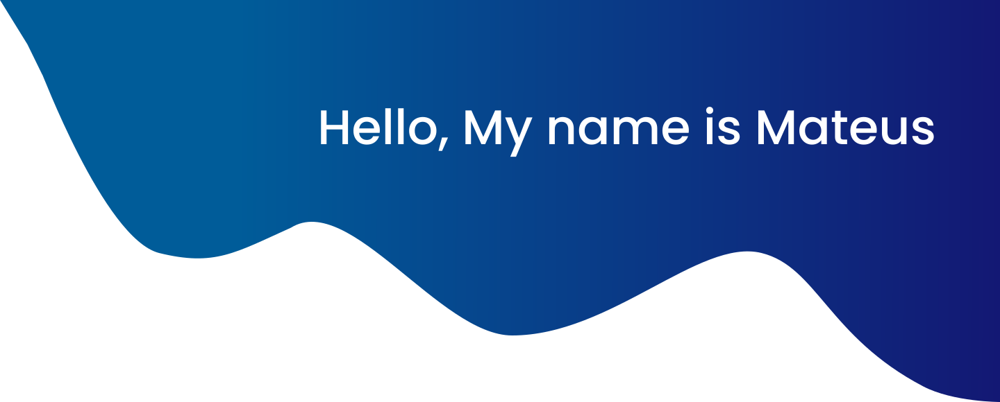

  I'm a passionate developer primarily working with Python. I also work with React, TypeScript,
  JavaScript, CSS, and HTML to build modern, responsive front-end interfaces.

  In my free time, I spend a lot of time on exercises that help me develop my problem-solving logic and
  grow my perspective. Whether it's working on CodeWars or other platforms, I love challenging myself to
  solve problems and continuously improve my skills.

---

## ❔ Interesting facts

- I am eager to collaborate on projects that utilize Python.
- I am currently enhancing my skills in JavaScript and deepening my understanding of the mathematics fundamental to Machine Learning and Data Science.
- In my spare time, I enjoy playing chess and studying photography.
- I love to hear classical music.

## ☕ Let's Connect

  
  
  
  

