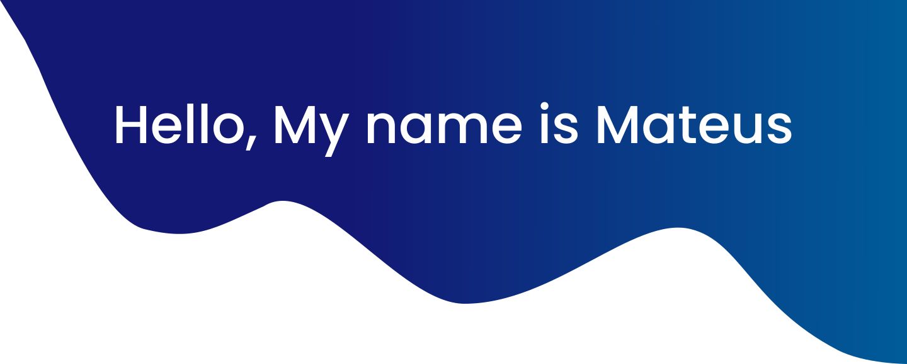
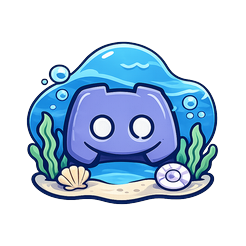
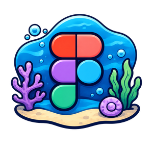
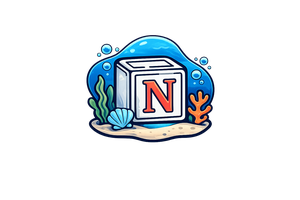
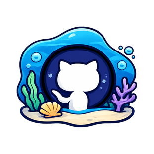

## 🖥️ Who am I

<!-- animated ASCII portrait + neofetch-style info card. To regenerate
     after swapping images/profile-source.jpg, or after editing the
     CONFIG section in scripts/make_info_card.py, run:
       python scripts/make_ascii_svg.py images/profile-source.jpg mateus-ascii.svg --cols 90
       python scripts/make_info_card.py mateus-info-card.svg -->

  I am currently studying Data Engineering and related concepts, with experience in MySQL, Tableau, Power BI, Excel, and MongoDB. Additionally, I have knowledge in Front-End development and am passionate about Python. I work with technologies such as React, TypeScript, JavaScript, CSS, and HTML to build modern, responsive front-end interfaces.

  In my free time, I focus on exercises that help develop my problem-solving logic and broaden my perspective. Whether it's solving challenges on platforms like CodeWars or others, I enjoy pushing myself to tackle problems and continuously enhance my skills.

<h3><code>mateusfeoliveira@github ~ $ whoami</code></h3>

<table>
<tr>
<td valign="top"></td>
<td valign="top"></td>
</tr>
</table>

## 🖥️ Contributions

<h3><code>mateusfeoliveira@github ~ $ ./contributions.sh</code></h3>

## ☕ Let's Connect

  
  
  
  
  
  

